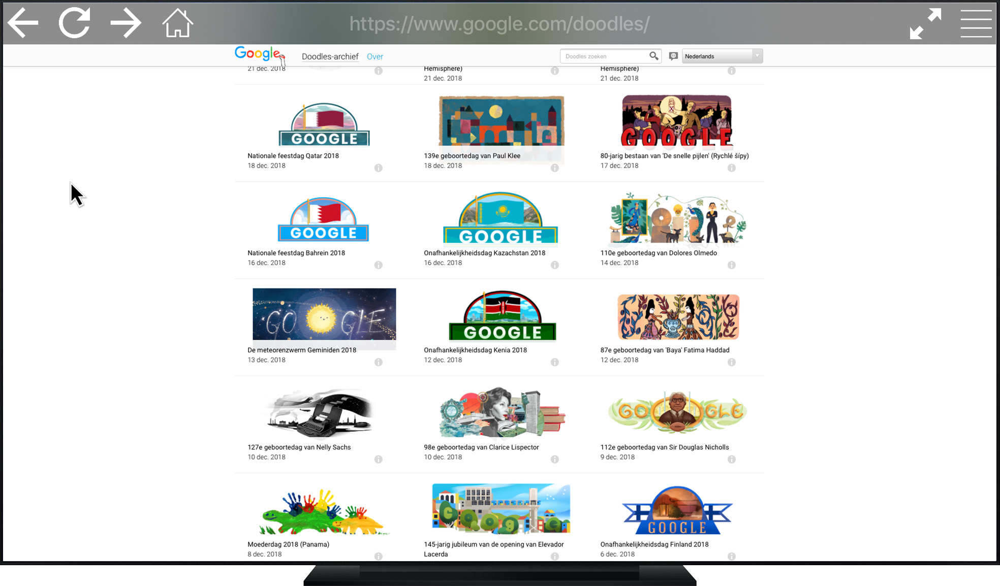
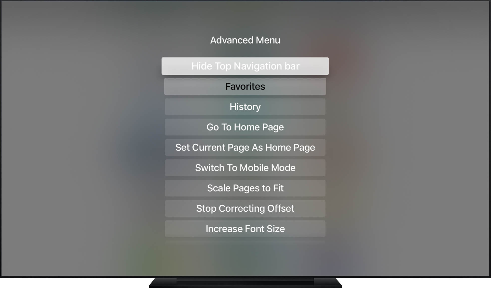

# A Web browser for AppleTV

Web browser for tvOS using a private API (`UIWebView`).

## Installing

For this you'll need an Apple TV for development with Xcode. For convenience,
you can also connect Xcode to Apple TV 4 and 4K wirelessly, as described
[here](http://www.redmondpie.com/how-to-wirelessly-connect-apple-tv-4k-to-xcode-on-mac/).

1. Clone this repo
2. Open the project in Xcode
3. Hit run

## How to use

### Actions

| Gesture                 | Action                    | 
| ----------------------- | ------------------------- |
| Click                   | Click                     |
| Double click            | Switch Cursor/Scroll mode |
| Play/Pause              | Open Quick Menu           |
| Double click Play/Pause | Open Advanced Menu        |

#### Quick menu
- URL Input
- Search Google
- Reload
- Navigate back

#### Advanced Menu
- Manage Favorites
- Manage History
- Set homepage
- Open homepage
- Change the User Agent
- Set page Scaling options
- Enable/Disable WebView offset correction
- Increase/decrease font size
- Clear cache
- Clear cookies
- Show the usage guide

## Screenshots

